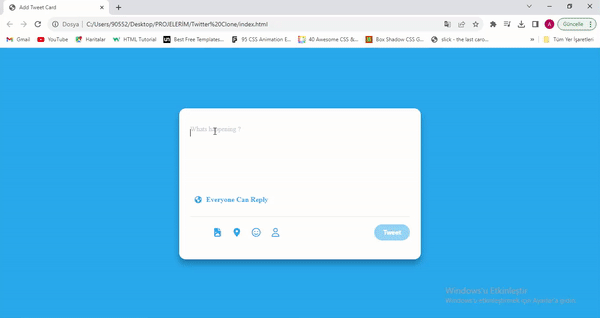

# Twitter-Clone

<h1>Twitter-Clone</h1>

- Twitter Tweet ekleme alanı tasarımı yapılacak*
- İnput Focus oldupunda (yani üstüne basıldığında ) rengi değişecek
- İnputta klavye girişi olduğunda  placeholder da gidecek
- alt kısmında bir sayac açılacak
- kalan karakter limitini tutacak
- Eğer inputta giriş yoksa tweet butonu pasif olacak
- karakter limiti aşımı geçtiğinde her fazla harf kırmızı background olacak
- sayactada geçilen karakter kırmızı ve eksi ile gösterilcek

<h2>Ekran goruntusu</h2>

